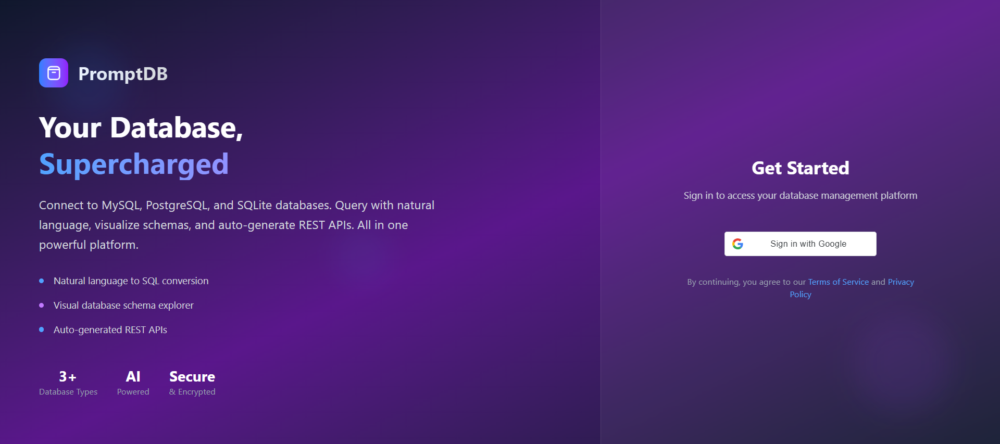
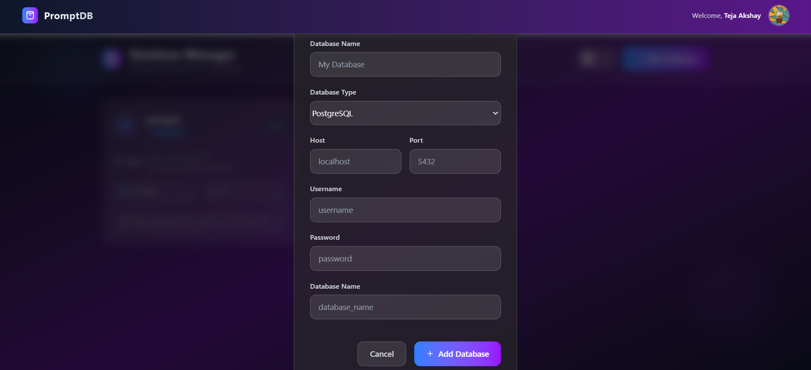
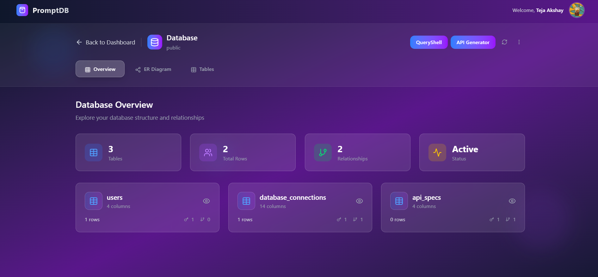
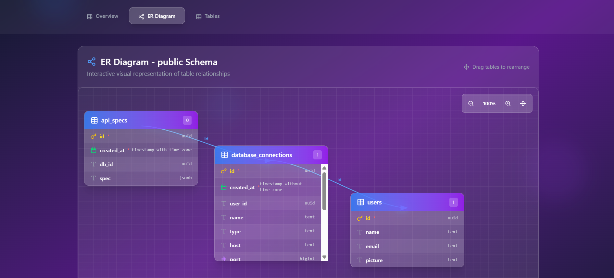
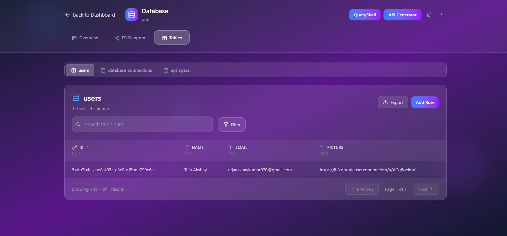
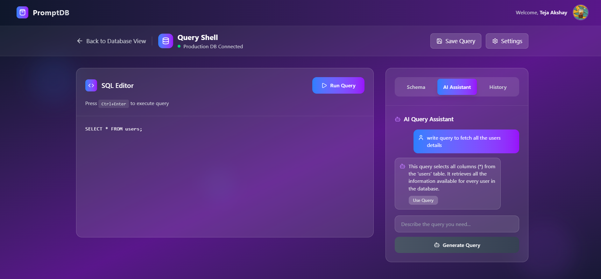
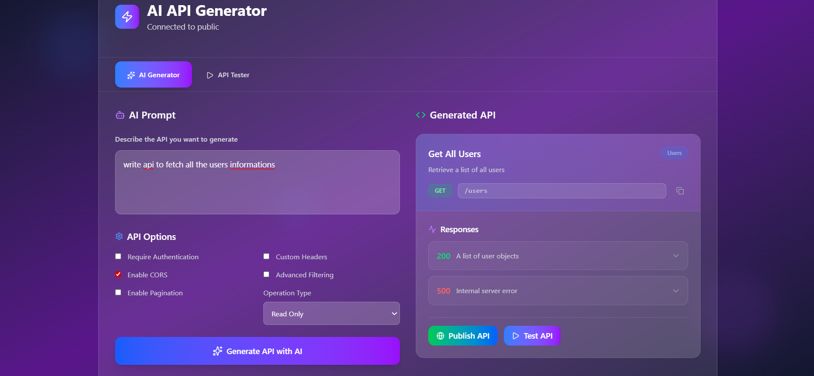
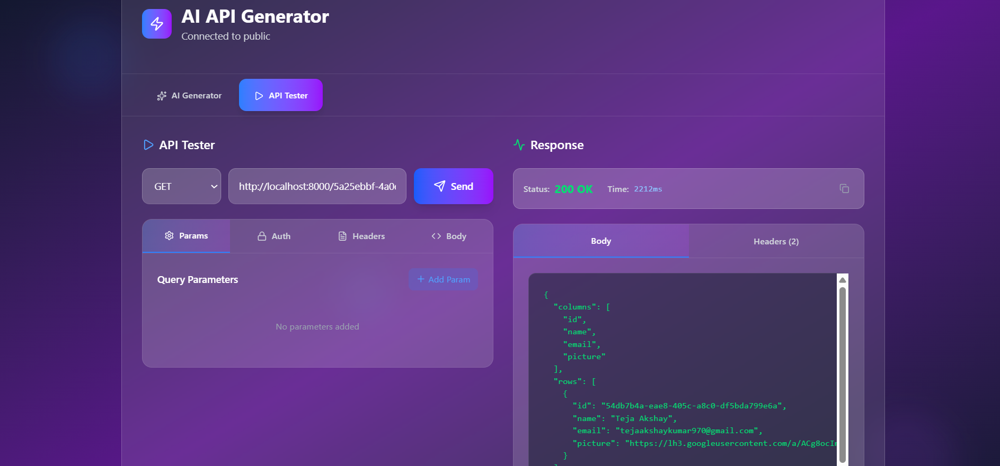

# Prompt DB 🚀

**Prompt DB** is a cloud-based platform where users can connect their own SQL databases, visually explore their structures, run SQL queries (via shell or natural language prompts), and auto-generate CRUD APIs that can be published and tested—all from a user-friendly dashboard.


## ✨ Features

- 🔐 **OAuth2 Google Authentication** via Google Cloud Console
- 🗂️ **Connect Multiple Databases**: MySQL, PostgreSQL, SQLite
- 📊 **Visual Database Viewer**: Schemas, tables, columns, ER diagrams
- 🧾 **Table Viewer**: Browse table rows with pagination
- 💻 **SQL Query Shell**: Write and run SQL queries in real time
- 🤖 **AI Query Generator**: Type natural language → get SQL
- 🛠️ **API Generator**: Instantly create, publish, and test APIs
- 🧪 **API Testing Sandbox** built into the platform

---

## 🖼️ Screenshots

### 🔐HomePage



---

### 🏠 Dashboard - Saved Databases


---

### ➕ Add New Database



---

### 🧬 Database Structure Viewer



---

### 🧬 Database ER Diagram



---

### 📑 Table Viewer



---


### 🧠 AI-Powered Query Generator



---

### 🧠 AI-Powered API Generator



---

### 🔄 Publish & Test APIs



---

## 🧰 Tech Stack

### 🔧 Backend

- ⚡ **FastAPI** – Lightweight Python web framework for async APIs
- 💽 **Supabase** – Stores user info and database connections

### 🌐 Frontend

- ⚛️ **React + TypeScript**
- 🎨 **Tailwind CSS** – Utility-first styling
- 🔐 **Google OAuth2** – via Google Cloud Console

---

## 🧭 Workflow Overview

### 1. 🔐 Authentication

- Login/signup using **Google OAuth2**
- On first login, create user profile in Supabase DB

---

### 2. 🏠 Dashboard

- View saved databases
- Status: Connected / Disconnected
- Button: **➕ Add New Database**

---

### 3. ➕ Add New Database

- Input:
  - **DB Type**: MySQL | PostgreSQL | SQLite
  - **Credentials**: host, port, username, password, db name
- Action:
  - Attempt connection
  - On success → Save to backend (linked to user)

---

### 4. 📂 Database Viewer

- Select a DB → Visual tree:
  - Schemas → Tables → Columns
- Auto-generate ER Diagrams

---

### 5. 📄 Table Viewer

- Click table → View paginated data

---

### 6. 💻 SQL Shell

- Write SQL queries and execute
- Output shown in results panel

---

### 7. 🤖 AI Query Generator

- Prompt: _"Get all users who signed up this month"_
- Result: `SELECT * FROM users WHERE signup_date >= ...`

---

### 8. 🧠 AI API Generator

- User enters intent → auto-create FastAPI route
- Choose:
  - **Method**: GET | POST | PUT | DELETE
  - **Options**: Auth required? Pagination? Filtering?

---

### 9. 🌐 Publish & Test APIs

- Once generated, users can:
  - View API route
  - Test with input/output panel
  - Get code snippets to use in apps

---


# 🚀 Getting Started

Follow these steps to set up and run the Prompt DB project locally.

---

📦 Folder Structure
```bash
prompt-db/
├── SQL/
│   ├── src/
│   ├── .env
│   └── ...
├── backend/
│   ├── main.py
│   ├── requirements.txt
│   ├── .env
│   └── ...
├── screenshots/
└── README.md
```


## 🔨 Frontend

```bash
cd SQL
npm install
npm run dev
```
This will start the React + TypeScript frontend on http://localhost:5173.

⚙️ Backend
```bash
cd backend
pip install -r requirements.txt
uvicorn main:app --reload
```
This will start the FastAPI backend server on http://localhost:8000.

## 🔒 Environment Variables

Create a `.env` file for storing Environment Variables in both SQL(frontend) & backend folder [as shown in Folder Structure]:

IN SQL folder
```env
VITE_GOOGLE_CLIENT_ID=your_google_client_secret
```

IN Backend Folder
```env
SUPABASE_URL=https://your-project.supabase.co
SUPABASE_KEY=your_anon_or_service_key
GEMINI_API_KEY=your-gemini-api-key
```